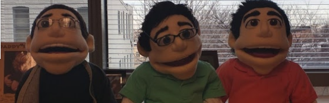

------

As part of our goal of teaching the world about statistics and data science, we have aquired way-too-realistic puppets made up to look like the co-directors of the data science lab. Visiting the puppets is now a key part of visiting Johns Hopkins Biostatistics/the JHUDSL.

<blockquote class="twitter-tweet" data-lang="en">
While at Hopkins we made sure to do some serious statistics: <a href="https://twitter.com/LucyStats">@LucyStats</a> plays with puppet <a href="https://twitter.com/rdpeng">@rdpeng</a> <a href="https://t.co/hUePyPzwIA">pic.twitter.com/hUePyPzwIA</a>
&mdash; Nick Strayer (@NicholasStrayer) <a href="https://twitter.com/NicholasStrayer/status/803345908402360321">November 28, 2016</a></blockquote>

<blockquote class="twitter-tweet" data-lang="en">
I thought I came to Hopkins to film a Christmas special w/ <a href="https://twitter.com/LeekPuppet">@LeekPuppet</a> <a href="https://twitter.com/puppetpeng">@puppetpeng</a> <a href="https://twitter.com/TenuredBCaffo">@TenuredBCaffo</a> but they just wanted a seminar ¯\_(ツ)_/¯ <a href="https://t.co/Ke8CI1jFJg">pic.twitter.com/Ke8CI1jFJg</a>
&mdash; Jenny Bryan (@JennyBryan) <a href="https://twitter.com/JennyBryan/status/805907625904902144">December 5, 2016</a></blockquote>

------

They also have their own Twitter accounts (which, hilariously enough we didn't create) [LeekPuppet](https://twitter.com/leekpuppet) and [PengPuppet](https://twitter.com/puppetpeng) and their own [Youtube channel](https://www.youtube.com/channel/UCAX7NABv5SXvV83mJD1D1Gg). 

Stay tuned for much more from the puppets. 

