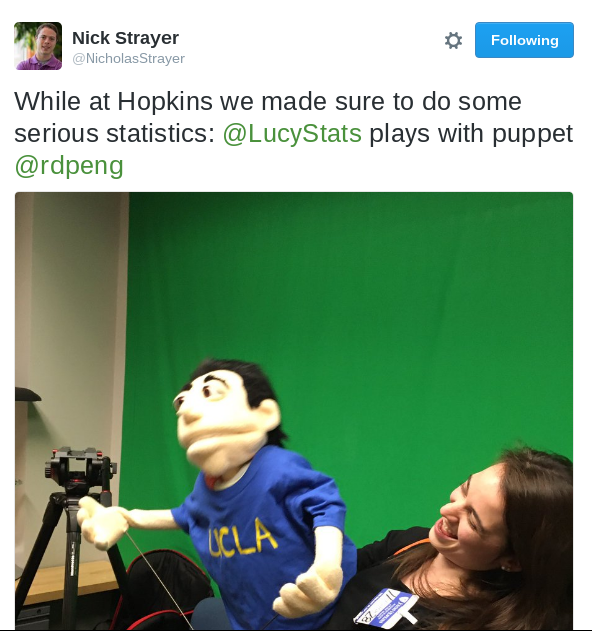
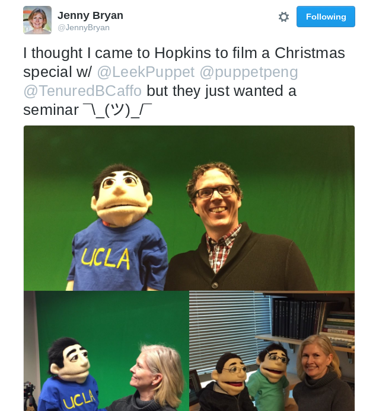

------

As part of our goal of teaching the world about statistics and data science, we have aquired way-too-realistic puppets made up to look like the co-directors of the data science lab. Visiting the puppets is now a key part of visiting Johns Hopkins Biostatistics/the JHUDSL.

------

They also have their own Twitter accounts (which, hilariously enough we didn't create) [LeekPuppet](https://twitter.com/leekpuppet) and [PengPuppet](https://twitter.com/puppetpeng) and their own [Youtube channel](https://www.youtube.com/channel/UCAX7NABv5SXvV83mJD1D1Gg). 

Stay tuned for much more from the puppets. 

